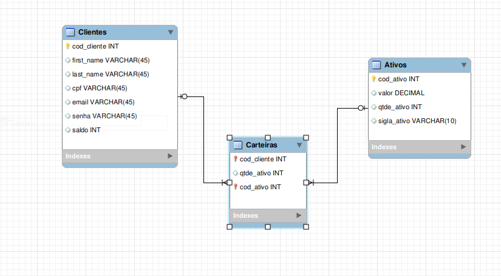

# Desafio Técnico Xp inc.

### Desafio
* O objetivo do projeto é desenvolver uma aplicação em back-end que se assemelha ao dia a
dia de uma grande corretora, um aplicativo de investimento em ações, com algumas
funcionalidades de conta digital.

### Banco de Dados

* O banco de dados foi desenvolvido com sequelize e está hospedado no supabase que usa postgreSQL como SGBD e alimenta a api em tempo real.
* A senha salva no banco de dados é a senha depois de ser criptografadas, caso ocorra algum vazamento do banco de dados, a senha do cliente não será exposto.



## Api

* <b>OBS:<b> Para o uso da api, é necessário requisitar o token na rota post /login, enviando um objeto contendo seu email e senha no <b>body da requisição: { email: emailCadastrado@email.com, senha: senhaCadastrada }<b>. Caso não tenha cadastro, seŕa necessário se registrar na rota post login/create, enviando no <b>body da requisição um objeto contendo: { cpf: 11 digitos, email: email@email.com, firstName: string, lastName: string, senha: minimo 5 digitos }<b>. Após obter o token, informar no hearders na chave authorization antes de requisitar.

* A api foi desenvolvida em node.js, usando express para construção de uma api RESTFull e respeitando as camadas do modelo MSC (Model, service e controller).
* Para o deploy, foi utilizado o heroku, configurado para rodar com docker.

### 🚀 [Minha api](https://case-xp-italo.herokuapp.com/) 
```
https://case-xp-italo.herokuapp.com/
```

</br>
### Integração continua (CI)
* Foi implementado a automatização dos testes de eslint em todos os push/pull request


## :heavy_check_mark: Validações
> #### A rota post `/login`:
<details>
 -  Valida se foi incluído os dados necessários no body da requisição e que eles são válidos.
</br>
 -  Valida se o email consta no banco de dados.
</br>
 -  Valida se a senha está correta.
 </details>
 </br>
 
> #### A rota post `/login/create`:
<details>
  - Valida se foi incluído os dados necessários no body da requisição e que eles são válidos.
</br>
  - Valida se o email ja foi cadastrado no banco de dados.
</br>
</details>
 </br>

> #### A rota `get /conta/:codCliente`:
<details>
 - Valida se o token foi passado e é um token valido e se o usuário salvo no token existe no nosso sistema.
</br>
 - Valida se é possivel encontrar o cliente pelo id informado nos parametros da requisição.
</br>
 - Valida se as informações sobre a conta requeridas pertence a pessoa que solicitou.
 </details>
 </br>
 
> #### A rota post `/conta/saque`:
<details>
 - Valida se o token foi passado e é um token valido e se o usuário salvo no token existe no nosso sistema.
</br>
 - Valida se foi incluído os dados necessário no body da requisição e se o valor do saque é maior que zero.
</br>
 - Valida se o saldo é suficiente.
</br>
 - Valida se uma transação falhar, ela volta para seu estado anterior e em caso de sucesso, a transação persiste no banco de dados, respeitando as regras ACID.
</br>
 - Valida se o id do body pertence ao id do token que solicitou.
</details>
 </br>

> #### A rota post `/conta/deposito`:
<details>
 - Valida se o token foi passado e é um token valido e se o usuário salvo no token existe no nosso sistema.
</br>
 - Valida se foi incluído os dados necessário no body da requisição e se o valor de depósito é maior que zero.
</br>
 - Valida se uma transação falhar, ela volta para seu estado anterior e em caso de sucesso, a transação persiste no banco de dados, respeitando as regras ACID.
</br>
 - Valida se o id do body pertence ao id do token que solicitou.
</details>
 </br>

> #### A rota get `assets/ativos/:codAtivo`:
<details>
 - Valida se é possivel encontrar o ativo enviado através da request.params.respeitando as regras ACID.
</details>
 </br>
 
> #### A rota `get client/ativos/:codCliente`:
<details>
 - Valida se o token foi passado e é um token valido e se o usuário salvo no token existe no nosso sistema.
</br>
 - Valida se é possivel encontrar o cliente pelo id informado nos parametros da requisição.
</br>
 - Valida se as informações sobre a conta requeridas pertence a pessoa que solicitou.
</br>
</details>
 </br>
 
> #### A rota `post investimentos/comprar`:
<details>
 - Valida se o token foi passado e é um token valido e se o usuário salvo no token existe no nosso sistema.
</br>
 - Valida se é possivel encontrar o cliente pelo id informado no body da requisição.
</br>
 - Valida se o saldo é suficiente.
</br>
 - Valida se é possivel encontrar o ativo pelo id informado no body da requisição.
</br>
 - Valida se o id do body pertence ao id do token que solicitou.
</br>
</details>
 </br>
 
> #### A rota `post investimentos/vender`:
<details>
 - Valida se o token foi passado e é um token valido e se o usuário salvo no token existe no nosso sistema.
</br>
 - Valida se é possivel encontrar o cliente pelo id informado no body da requisição.
</br>
 - Valida se a quantidade do ativo é suficiente para a venda.
</br>
 - Valida se é possivel encontrar o ativo pelo id informado no body da requisição.
</br>
 - Valida se o id do body pertence ao id do token que solicitou.
</details>

## :fire: Começando

Essas instruções permitirão que você obtenha uma cópia do projeto em operação na sua máquina local para fins de desenvolvimento e teste.


## 🔧 Instalação


### 1. Clone o repositório
 * Clone na sua maquina local, no diretório que escolher.
    ```
    git clone https://github.com/andrade-italo/xp-case.git
    ``` 
 * Entre na pasta do repositório que você acabou de clonar:
    ```
    cd xp-case
    ```

### 2. Instale as dependências
 * Instale todas as dependências 
    ```
    npm install    
    ```
 
### 3. Crie uma branch a partir da branch `main`
 * Verifique que você está na branch `main`
    ```
    git branch
    ```
 * Se não estiver, mude para a branch `main`
    ```
    git checkout main
    ```
 * Agora crie uma branch à qual você vai submeter os `commits` do seu projeto
    ```
    git checkout -b nome-de-sua-branch
    ```
### 4.Execute a aplicação
 * Rode a aplicação localmente
    ```
    npm run dev
    ```
  
## ⚙️ Testes

### 🔩 Testes de ponta a ponta

Houve inprevistos com os testes de integração e não foi possível ser concluídos dentro do prazo. Deixo registrado a pasta de testes para somente consulta e me comprometo a realizar a inclusão dos testes futuramente.

### ⌨️ Testes de estilo de codificação

 * ### Eslint
  ```
  npm run lint
  ```

## 📦 Desenvolvimento

 * O repositório contem instruções para realizar testes de estilo de codificação diretamente no github.

## 🛠️ Construído com

Mencione as ferramentas que você usou para criar seu projeto

* [JWT](https://jwt.io/) - O JWT é um padrão da Internet para a criação de dados com assinatura opcional e/ou criptografia. 
* [Git](https://git-scm.com/doc) - Sistema de Controle de Versões Distribuído 
* [Node.js](https://nodejs.org/en/docs/) -  Ambiente de execução Javascript server-side.
* [EsLint](https://eslint.org/docs/latest/user-guide/getting-started) - ESLint é uma ferramenta de análise de código estática para identificar padrões problemáticos encontrados no código JavaScript.
* [Sequelize](https://sequelize.org/) - ORM (Object-Relational Mapper) para Node.js
* [Heroku](https://devcenter.heroku.com/categories/reference) - Heroku é uma plataforma de nuvem como serviço que suporta várias linguagens de programação.
* [Docker](https://www.docker.com/) - Docker é um conjunto de produtos de plataforma como serviço que usam virtualização de nível de sistema operacional para entregar software em pacotes chamados contêineres. 
* [Supabase](https://supabase.com/docs) - É uma alternativa de código aberto ao Firebase. (Banco de dados em nuvem).
* [PostgreSQL](https://www.postgresql.org/docs/) - Sistema gerenciador de banco de dados objeto relacional
* [Github actions](https://docs.github.com/pt/actions) - lataforma de integração contínua e entrega contínua (CI/CD) que permite automatizar a sua compilação, testar e pipeline de implantação.

## ✒️ Autor

* [**Italo Andrade**](https://github.com/andrade-italo)

## 📄 Licença

Este projeto está sob a licença **MIT** - veja o arquivo [LICENSE.md](https://github.com/andrade-italo/xp-case/blob/main/LICENSE.md) para detalhes.

## 🎁 Expressões de gratidão

* Agradeço a Xp inc. pela oportunidade de participar do processo.
* Agradeço a trybe pelo ensino ofertado.
* Agradeço a minha família por ter entendido minha ausência na semana do case.


---
Inspiração para o readme: https://gist.github.com/lohhans/f8da0b147550df3f96914d3797e9fb89
